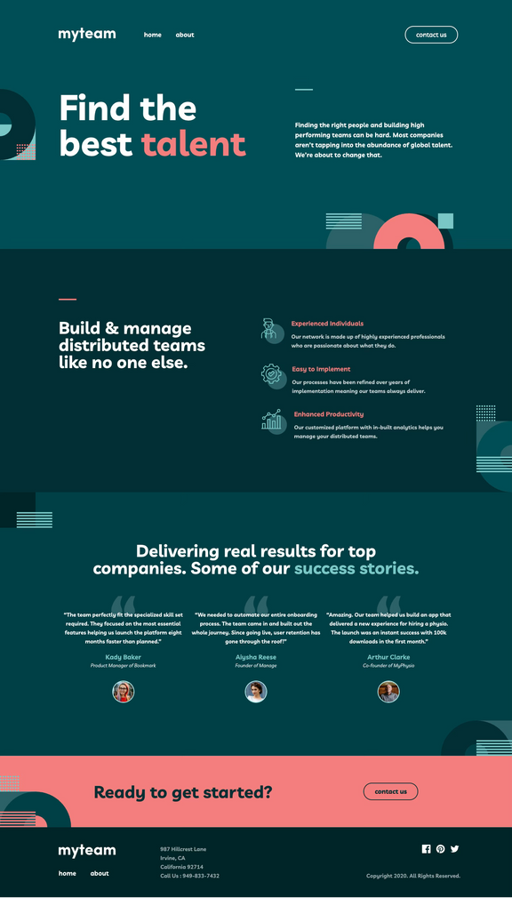
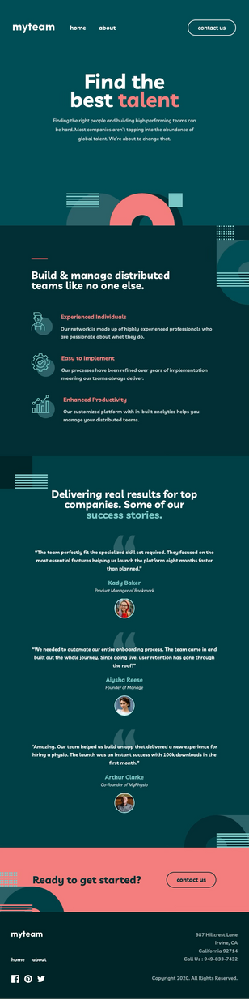
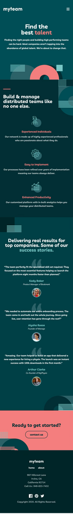

# 👥 MyTeam Multi-Page Website

Responsive multi-page website for showcasing a team. Features an expandable About page and a contact form with validation. Built to look great across desktop, tablet, and mobile.

🔗 **Live Demo**: [https://myteam-multi-page-website.vercel.app/](https://myteam-multi-page-website.vercel.app/)

---

## 🧱 Tech Stack

- Vue.js  
- HTML5  
- CSS Grid & Flexbox  
- Responsive Web Design

---

## 📱 Responsive Previews

| Desktop                     | Tablet                     | Phone                     |
|----------------------------|----------------------------|---------------------------|
|     |      |      |

---

## ✨ Features

- Fully responsive multi-page layout
- About page with expandable content sections
- Contact form with client-side validation
- Clean and modern design with accessibility in mind

---

## 🛠️ Project Setup

```bash
yarn install
```

### Compiles and hot-reloads for development

```bash
yarn serve
```

### Compiles and minifies for production

```bash
yarn build
```

### Lints and fixes files

```bash
yarn lint
```

### Customize configuration

See [Configuration Reference](https://cli.vuejs.org/config/).
